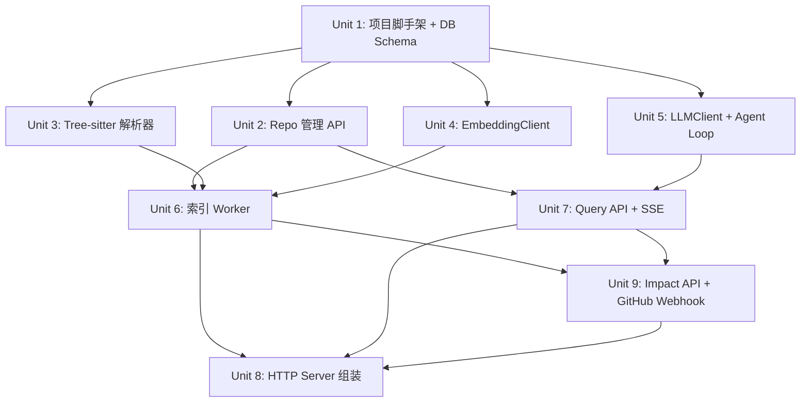

# feat: LogicMap Core Service

## Overview

从零构建 LogicMap：一个本地 HTTP API 服务，预建代码库调用图索引，支持自然语言查询任意函数的内部逻辑链路。核心技术链路：Tree-sitter 静态解析 → PostgreSQL/pgvector 持久化 → Redis Streams 异步任务队列 → LLM Tool Use agentic loop → SSE 流式响应。

## Problem Frame

AI 辅助编程导致代码量暴涨，但 Claude Code 等工具每次查询都要重新扫描文件、消耗大量 token，对大型项目无法维持持久化的全局认识。LogicMap 用预建索引替代每次重扫，将查询成本从 O(文件数) 降到 O(1) cache hit / O(agent 工具调用次数) cache miss。（see origin: docs/brainstorms/2026-04-02-logicmap-requirements.md）

## Requirements Trace

- R1. 注册本地代码库（路径 + 自动语言探测）
- R2. 全量 + 增量索引（手动触发）
- R3. 异步索引，返回 task_id，可查询任务状态
- R4. Tree-sitter 多语言解析（Go / Python / TypeScript）
- R5. 索引：函数源码 + 调用图 + 文件路径/行号
- R6. pgvector 函数 embedding，支持语义检索
- R7. 调用图存 PostgreSQL（adjacency list）
- R8. 并发索引 worker（goroutine + semaphore）
- R9. 自然语言查询（POST /query）
- R10. SSE 流式响应
- R11. 自然语言描述 + 内联代码片段
- R12. Redis cache（repo_id + 精确字符串键，TTL 可配置）
- R13. LLM Tool Use：get_function_source / get_callees / get_callers / search_similar_code
- R14. 多 LLM 后端：OpenAI / Anthropic / Ollama（LLMClient interface）
- R15. 结构化 JSON 调用链 → 渲染为自然语言 + 代码片段
- R16. Redis Streams 异步索引队列
- R17. Redis 查询结果缓存
- R18. 无认证（单用户本地）
- R19. 环境变量配置

## Scope Boundaries

- 不做 Web UI
- 不做多用户、认证、权限隔离
- 只做静态分析，不分析运行时调用
- 不支持跨代码库查询
- 不做 diff 历史分析，只分析当前代码状态
- MVP 不做 Git hook 自动触发
- 不做配置热加载（重启服务更新 key）

## Context & Research

### Relevant Code and Patterns

- 全新项目，无现有代码参考
- 参考项目布局：`golang-standards/project-layout`（domain-first 变体，见 Key Technical Decisions）
- pgvector-go 官方示例：`github.com/pgvector/pgvector-go/cmd/` 中有完整 pgx+pgvector 集成示例
- Mattermost AI plugin LLM interface：`github.com/mattermost/mattermost-plugin-ai/llm` 可作为 multi-provider tool call interface 参考

### Institutional Learnings

- 无历史 learnings（新项目）

### External References

- Tree-sitter 官方 Go binding：`github.com/tree-sitter/go-tree-sitter` v0.25.0（2025-02 发布，替换 smacker 版本）
- pgvector-go + pgx/v5 集成文档：[brandur.org/sqlc](https://brandur.org/sqlc)
- Redis Streams consumer group 模式：go-redis/v9 官方文档，`XReadGroup` / `XAck` / `XAutoClaim`

## Key Technical Decisions

- **官方 tree-sitter/go-tree-sitter 替代 smacker/go-tree-sitter**：官方版本于 2025-02 发布 v0.25.0，语法包模块化（只导入需要的语言），是新项目的正确选择；smacker 版是社区维护的旧版本。每个 `Parser`/`Tree`/`Query` 对象必须 `defer .Close()`，作为代码规范强制执行。

- **Adjacency list 存储调用图（而非 ltree/递归 CTE）**：agentic loop 设计中 LLM 通过 tool 调用逐层探索调用链（`get_callees`/`get_callers`），不需要 DB 层做深度遍历，adjacency list (`call_edges` 表) 足够且更简单。

- **EmbeddingClient 与 LLMClient 两个独立 interface**：embedding 生成（文本 → `[]float32`）和 chat tool use（streaming completion）是不同 API 端点，即使同一个供应商（OpenAI 用 `/embeddings` vs `/chat/completions`）。分离 interface 允许 embedding 和 LLM 使用不同供应商（例如 OpenAI embedding + Ollama chat）。

- **Embedding 维度锁定为 1536，Ollama 后端适配**：`functions.embedding` 列固定为 `vector(1536)`，这是 pgvector 的 DDL 约束，不可在运行时更改。Ollama 的 nomic-embed-text-v1.5 支持 Matryoshka 截断至任意维度（包括 1536），Ollama `EmbeddingClient` 实现必须保证输出 1536 维，不依赖 API 默认值。`EmbeddingClient` interface 文档注明此约束，实现者必须保证维度一致。

- **callee 解析两阶段写入**：全文件解析完成后（Phase 1）再统一做 callee_name → UUID 解析（Phase 2），避免并发解析时 callee 函数未插入 PG 的 race。Phase 2 用单条 `SELECT id, name, file_path FROM functions WHERE repo_id=$1` 建内存 map，再用 `CopyFrom` 批量写入 `call_edges`，避免 N+1 查询。无法解析的 callee（外部库、歧义名）写入 `unresolved_edges` 表而非静默丢弃，`get_callees` tool 可标注外部调用。

- **Repo status 从 tasks 派生（非直接写入）**：`repos` 表不单独维护 status 字段的 `indexing` 状态，`GET /repos/{id}` 通过 JOIN 最近 task 计算当前状态：有 `pending/running` task → `indexing`；最近 task `completed` → `indexed`；无 task → `registered`。消除 API handler 写 status 与 enqueue 之间的竞争窗口。孤儿 task（超过 `STALE_TASK_THRESHOLD_MINUTES` 仍 pending/running）视为失效，新的索引请求可覆盖。

- **全量重建时延迟 HNSW 索引**：全量索引期间先 DROP HNSW index，`CopyFrom` 批量写入所有 vectors 后再 `CREATE INDEX CONCURRENTLY`，避免逐行触发 HNSW 维护导致性能退化（50,000+ 向量时可慢 10-30x）。增量索引行数少，HNSW 实时维护可接受。Job payload 携带 `type: full|incremental` 以区分路径。

- **解析和 embedding 使用独立 semaphore**：文件解析（CPU 密集）semaphore 值 = `WORKER_CONCURRENCY`（默认 GOMAXPROCS-1）；embedding API 调用（I/O 密集，有限流）semaphore 值 = `EMBEDDING_CONCURRENCY`（默认 3，Ollama 后端强制为 1）。两者独立配置，避免互相阻塞。

- **Domain-first 目录布局**（非 layer-first）：`internal/repo/`、`internal/indexer/`、`internal/query/`、`internal/agent/` 分别包含各域的 handler+service+store，而非 `handlers/`、`services/`、`repositories/` 的分层布局。防止跨域耦合，每个域的文件聚合在一起。

- **sqlc + pgx/v5 替代 GORM**：调用图遍历和向量相似度搜索都是定制 SQL，ORM 抽象无收益反增复杂度；sqlc 生成类型安全 Go，保持原生 SQL 性能。

- **Task 状态存 PostgreSQL（非 Redis）**：Task 记录需要持久化（worker 重启后可恢复），Redis 无持久化保证。状态枚举：`pending / running / completed / failed / partial`。

- **Cache 存结构化 JSON（非原始 SSE bytes）**：避免存储格式与 SSE 传输格式耦合；命中 cache 时从 JSON 重新流式渲染为 SSE，便于未来调整响应格式。

- **Agent loop 硬上限：20 次工具调用 + 30 秒超时**：防止 LLM 在深调用链（如标准库）上无限递归。超出时截断并发送 `{"type":"warning","message":"response truncated"}` SSE event。

- **XAUTOCLAIM 处理 worker 崩溃**：Redis Streams PEL 中挂起超过 30 秒的消息通过 `XAUTOCLAIM` 重新分配给活跃 consumer，避免任务永久卡死。

## Open Questions

### Resolved During Planning

- **增量索引一致性**：全量索引 = 先删除该 repo 所有 functions/call_edges/tasks，再写入；增量索引 = 对变更文件的 functions upsert（by file_path + function name），对不再存在的文件执行 `DELETE FROM functions WHERE repo_id = $1 AND file_path = ANY($2)`，变更范围通过比对上次索引的文件集合快照确定（存入 `repos.indexed_files`，JSON 列）。

- **并发索引冲突**：`POST /repos/{id}/index` 在 enqueue 前查询 `tasks` 表，如存在 `status IN ('pending','running')` 的 task，返回 409 + 现有 task_id。

- **查询时 repo 未就绪**：检查 `repos.status` 字段，非 `indexed` 或 `partial` 时返回 400 `{"error":"repo_not_ready","status":"<current_status>"}`。

- **重复注册同路径**：幂等，`INSERT ... ON CONFLICT (path) DO NOTHING RETURNING id`，返回 200 + 已有 repo_id。

- **GET /tasks/{task_id} 接口定义**：路由 `GET /tasks/{id}`，响应 `{task_id, repo_id, type, status, started_at, completed_at, error, stats:{files_total, files_processed, functions_indexed, errors:[]}}`。

### Deferred to Implementation

- **Ollama embedding 维度适配**：schema 固定 `vector(1536)`，Ollama `EmbeddingClient` 实现使用 nomic-embed-text-v1.5 并指定 `dimensions: 1536`（Matryoshka 截断），或使用 mxbai-embed-large（默认 1024，不适用）。实现时验证 Ollama API 是否支持 `dimensions` 参数（0.3.6+ 支持），若不支持则零填充至 1536。

- **sqlc query 文件组织**：每个域（repo/indexer/query）各自的 `.sql` 文件放在 `sqlc/queries/<domain>/` 还是统一在 `sqlc/queries/`——实现时按实际边界决定。

- **Tree-sitter query 语法**：各语言的函数定义和函数调用的 s-expression query 需要针对每种语言分别调试，实现时验证。

## High-Level Technical Design

> *以下为方向性设计指引，供 reviewer 验证架构意图，实现方不应将其视为需要照字面执行的规范。*

### 系统组件交互

```
┌──────────────────────────────────────────────────────────────────┐
│                         HTTP API (chi)                           │
│  POST /repos  POST /repos/{id}/index  GET /tasks/{id}            │
│  POST /query                                                     │
└────────────┬───────────────────────────────┬─────────────────────┘
             │                               │
             ▼                               ▼
   ┌─────────────────┐             ┌──────────────────────┐
   │  repo.Service   │             │   query.Service      │
   │  - register     │             │   - cache check      │
   │  - enqueue job  │             │   - agent invoke     │
   └────────┬────────┘             │   - cache write      │
            │                      └──────────┬───────────┘
            │ XAdd                            │
            ▼                                 ▼
   ┌─────────────────┐             ┌──────────────────────┐
   │  Redis Streams  │             │   agent.Agent        │
   │  "index-jobs"   │             │   - tool use loop    │
   └────────┬────────┘             │   - max 20 calls     │
            │ XReadGroup           │   - 30s timeout      │
            ▼                      └──────────┬───────────┘
   ┌─────────────────┐                        │ tool calls
   │ indexer.Worker  │             ┌──────────▼───────────┐
   │ - parse files   │             │   agent.Tools        │
   │ - gen embeddings│             │   - get_function_src │
   │ - write PG      │             │   - get_callees      │
   │ - XAUTOCLAIM    │             │   - get_callers      │
   └────────┬────────┘             │   - search_similar   │
            │                      └──────────┬───────────┘
            ▼                                 │
   ┌─────────────────────────────────────────▼────────────┐
   │              PostgreSQL + pgvector                    │
   │  repos  tasks  functions  call_edges                  │
   │  (functions.embedding vector(1536) HNSW index)       │
   └───────────────────────────────────────────────────────┘
```

### Repo 状态机

```
registered ──[enqueue index]──► indexing
                                    │
                          ┌─────────┼─────────┐
                          ▼         ▼         ▼
                       indexed   partial   failed
                          │
                  [re-index trigger]
                          │
                       indexing (repeat)
```

### Agent Tool Use 伪逻辑

```
func (a *Agent) Run(ctx, question, repoID) (<-chan Event):
    calls = 0
    deadline = now + 30s
    messages = [systemPrompt, userQuestion]
    
    loop:
        if calls >= 20 || now > deadline:
            emit Warning("truncated")
            break
        
        response = llmClient.StreamWithTools(ctx, messages)
        emit TextChunks(response.text)
        
        if response.toolCalls is empty:
            break
        
        for each toolCall:
            result = tools.Execute(toolCall)
            messages.append(toolResult)
            calls++
    
    // render structured chain to SSE
    emit StructuredChain(response.chainJSON)
```

## Implementation Units



---

- [ ] **Unit 1: 项目脚手架、DB Schema 与迁移**

**Goal:** 建立可工作的项目骨架：go.mod、目录结构、数据库 schema、docker-compose。

**Requirements:** R7, R16, R19

**Dependencies:** 无

**Files:**
- Create: `go.mod`
- Create: `go.sum`
- Create: `cmd/server/main.go`（空 main，import 占位）
- Create: `internal/config/config.go`
- Create: `internal/db/postgres.go`
- Create: `internal/db/redis.go`
- Create: `internal/db/migrations/001_init.sql`
- Create: `internal/db/migrations/002_pgvector.sql`
- Create: `sqlc/sqlc.yaml`
- Create: `docker-compose.yml`
- Create: `Dockerfile`
- Create: `.env.example`
- Test: `internal/config/config_test.go`
- Test: `internal/db/postgres_test.go`（集成测试，需要真实 PG）

**Approach:**
- `go.mod` 声明 module `github.com/XbLuzk/logicmap`，Go 1.22+
- 核心依赖：`github.com/tree-sitter/go-tree-sitter`, `github.com/jackc/pgx/v5`, `github.com/pgvector/pgvector-go`, `github.com/redis/go-redis/v9`, `github.com/go-chi/chi/v5`, `github.com/pressly/goose/v3`, `github.com/sqlc-dev/sqlc`（dev tool），`github.com/caarlos0/env/v11`
- DB schema 核心表：
  - `repos(id uuid PK, path text UNIQUE, name text, indexed_files jsonb, created_at, updated_at)` — 无 status 字段，status 从 tasks 派生
  - `tasks(id uuid PK, repo_id uuid FK, type text, status text, started_at, completed_at, error text, stats jsonb)`
  - `functions(id uuid PK, repo_id uuid FK, name text, file_path text, start_line int, end_line int, source text, embedding vector(1536), created_at)` — UNIQUE(repo_id, file_path, name)
  - `call_edges(id uuid PK, repo_id uuid FK, caller_id uuid FK→functions, callee_id uuid FK→functions)` — 仅已解析的同仓库调用
  - `unresolved_edges(id uuid PK, repo_id uuid FK, caller_id uuid FK→functions, callee_name_raw text)` — 外部库调用或歧义调用
  - HNSW index：`CREATE INDEX ON functions USING hnsw (embedding vector_cosine_ops)`（全量重建时 DROP 后重建）
- `internal/config/config.go`：用 `env` tag 读取所有配置，包括 `DATABASE_URL`, `REDIS_URL`, `LLM_BACKEND`, `LLM_API_KEY`, `EMBEDDING_BACKEND`, `EMBEDDING_API_KEY`, `QUERY_CACHE_TTL`, `WORKER_CONCURRENCY`（默认 GOMAXPROCS-1）, `EMBEDDING_CONCURRENCY`（默认 3，Ollama 时强制 1）, `STALE_TASK_THRESHOLD_MINUTES`（默认 10）
- `docker-compose.yml`：postgres（pgvector 镜像 `pgvector/pgvector:pg16`）+ redis:7 + logicmap service，volumes for PG data
- `internal/db/postgres.go`：pgxpool 初始化，AfterConnect 注册 pgvector 类型

**Patterns to follow:**
- pgvector-go 官方 `cmd/` 示例中的 `AfterConnect` 注册模式
- goose embedded migration：`//go:embed migrations/*.sql`

**Test scenarios:**
- Happy path: Config 从环境变量正确解析所有字段
- Edge case: 缺少必填字段（DATABASE_URL）时启动报明确错误
- Integration: pgxpool 连接成功，pgvector 类型注册无报错（需要真实 PG）
- Integration: goose 迁移在空库上成功运行，所有表和索引存在

**Verification:**
- `docker-compose up` 启动无报错
- `go build ./...` 通过
- 迁移后 PG 中存在 `repos`、`tasks`、`functions`、`call_edges` 表及 HNSW 索引

---

- [ ] **Unit 2: Repo 管理 API + Task 状态接口**

**Goal:** 实现 repo 注册、状态管理，以及 task 查询接口；建立 repo 状态机。

**Requirements:** R1, R2, R3, R18

**Dependencies:** Unit 1

**Files:**
- Create: `internal/repo/handler.go`
- Create: `internal/repo/service.go`
- Create: `internal/repo/store.go`
- Create: `sqlc/queries/repo.sql`
- Test: `internal/repo/service_test.go`
- Test: `internal/repo/handler_test.go`

**Approach:**
- 路由：`POST /repos`、`GET /repos/{id}`、`POST /repos/{id}/index`、`GET /tasks/{id}`
- `POST /repos`：幂等注册，`INSERT ... ON CONFLICT (path) DO NOTHING RETURNING id`；返回 `{repo_id, status}`
- Repo status 状态机：`registered → indexing → indexed / failed / partial`
- `POST /repos/{id}/index`：接受可选 query param `?type=full|incremental`（不传时默认：有 `indexed_files` 快照则 `incremental`，否则 `full`）
  1. 检查 repo 存在（404 otherwise）
  2. 查询 `tasks WHERE repo_id=$1 AND status IN ('pending','running') AND created_at > now() - STALE_TASK_THRESHOLD`，存在则返回 409 + task_id；超时孤儿 task 可覆盖
  3. 插入 task 记录（status=pending, type=full|incremental）
  4. 发布消息到 Redis Streams `XAdd index-jobs`（payload: task_id, repo_id, type）
  5. 返回 202 + task_id（不写 repos.status）
- `GET /repos/{id}`：JOIN 最近 non-stale task 计算 status：有非过期 pending/running task → `indexing`；最近 task completed/partial → `indexed`/`partial`；最近 task failed → `failed`；无 task → `registered`。**过期 task（超过 STALE_TASK_THRESHOLD）不计入 status 计算，视同无 task**
- `GET /tasks/{id}`：查询 tasks 表，返回完整 task 记录含 stats
- 路径不存在时 `POST /repos` 返回 422（在 service 层 `os.Stat` 验证）

**Test scenarios:**
- Happy path: 注册新 repo，返回 201 + repo_id
- Happy path: 重复注册同路径，幂等返回 200 + 原有 repo_id
- Happy path: 触发全量索引，返回 202 + task_id，Redis Streams 有消息
- Edge case: 注册不存在的路径，返回 422
- Edge case: 对不存在的 repo_id 触发索引，返回 404
- Error path: 已有 running task 时再次触发索引，返回 409 + 现有 task_id
- Happy path: GET /tasks/{id} 返回完整 task 状态

**Verification:**
- 所有路由按状态码规范响应
- Redis Streams 中消息结构正确（task_id, repo_id, type 字段存在）
- Repo 状态随 task enqueue 正确更新为 `indexing`

---

- [ ] **Unit 3: Tree-sitter 多语言解析器**

**Goal:** 解析源文件，提取函数列表（含源码、位置）和函数间调用关系（call edges）。

**Requirements:** R4, R5, R7

**Dependencies:** Unit 1

**Files:**
- Create: `internal/indexer/parser.go`
- Create: `internal/indexer/parser_test.go`
- Create: `internal/indexer/languages.go`（语言探测 + grammar 注册）

**Approach:**
- 使用官方 `github.com/tree-sitter/go-tree-sitter`，为每种语言导入对应 grammar 包
- 语言探测：根据文件扩展名（`.go`→Go，`.py`→Python，`.ts`/`.tsx`→TypeScript），返回对应 grammar
- 每种语言定义两套 Tree-sitter query（s-expression）：
  - 函数定义 query（`function_declaration`、`method_declaration` for Go；`function_definition`、`decorated_definition` for Python；`function_declaration`、`method_definition` for TypeScript）
  - 函数调用 query（`call_expression` 的 `function` 字段）
- `ParseFile(path string) ([]Function, []CallEdge, error)`：
  - 读取文件，调用 `Parser.Parse`
  - 对函数定义 query 匹配所有函数节点，提取名称、起止行、源码子串
  - 对函数调用 query 匹配所有调用点，建立 `{caller_function, callee_name}` 映射
  - 返回 `[]Function` 和 `[]CallEdge`（callee_name 为字符串，后续 worker 做 ID 解析）
- **所有 `Parser`/`Tree`/`Query`/`QueryCursor` 对象必须 `defer .Close()`**
- 目录扫描：`filepath.WalkDir` 过滤隐藏目录（`.git`, `vendor`, `node_modules`），并发处理文件（semaphore 限制并发数，来自 config）

**Test scenarios:**
- Happy path (Go): 解析含函数定义和调用的 `.go` 文件，正确提取函数名、行号、源码
- Happy path (Python): 同上，`.py` 文件
- Happy path (TypeScript): 同上，`.ts` 文件
- Edge case: 空文件解析不报错，返回空切片
- Edge case: 语法有错误的文件（Tree-sitter 容错），返回已解析部分，不 panic
- Edge case: 不支持的语言扩展名，返回特定错误，调用方可跳过
- Edge case: 函数调用目标是方法链 `a.b.c()`，至少提取叶子调用名

**Verification:**
- 对 LogicMap 自身的 Go 代码库跑解析，提取结果包含主要函数且无 panic
- `defer .Close()` 通过 `-race` 检测无内存/goroutine 泄露

---

- [ ] **Unit 4: EmbeddingClient 接口与实现**

**Goal:** 抽象 embedding 生成接口，实现 OpenAI 和 Ollama 两个后端。

**Requirements:** R6, R14（embedding 部分）

**Dependencies:** Unit 1

**Files:**
- Create: `internal/embedding/interface.go`
- Create: `internal/embedding/openai.go`
- Create: `internal/embedding/ollama.go`
- Create: `internal/embedding/batch.go`（批量 embedding 与限流）
- Test: `internal/embedding/openai_test.go`（httptest mock）
- Test: `internal/embedding/ollama_test.go`（httptest mock）

**Approach:**
- Interface：`EmbeddingClient { Embed(ctx, texts []string) ([][]float32, error) }`
- OpenAI 实现：POST `https://api.openai.com/v1/embeddings`，model `text-embedding-3-small`，输出 1536 维
- Ollama 实现：POST `http://localhost:11434/api/embeddings`，model `nomic-embed-text`，输出 768 维（实现时需确认维度，见 Deferred）
- `batch.go`：将大批量文本切成 batch_size=100 一组，通过 `EMBEDDING_CONCURRENCY` semaphore（`golang.org/x/sync/semaphore`）控制并发调用数；不使用 rate limiter，semaphore 即为并发控制机制；Ollama 实现在初始化时强制将 concurrency 设为 1
- 通过 config `EMBEDDING_BACKEND` 选择实现（`openai` | `ollama`）

**Test scenarios:**
- Happy path: OpenAI mock 返回正确 embedding，解析为 `[][]float32`
- Happy path: Ollama mock 返回正确 embedding
- Error path: HTTP 401（API key 无效），返回有意义错误（不 panic）
- Error path: HTTP 429（rate limit），实现重试或返回 rate limit error
- Edge case: 空文本列表，返回空切片，不调用 API
- Edge case: 单个文本超过 token 限制，优雅降级（截断 or 错误）

**Verification:**
- 所有测试用 `httptest.NewServer` mock，无真实 API 调用
- 通过 `-race` 检测无并发问题

---

- [ ] **Unit 5: LLMClient 接口、多后端实现与 Agent Loop**

**Goal:** 抽象 streaming tool use 接口，实现 Anthropic/OpenAI/Ollama 三个后端，构建带终止条件的 agent loop。

**Requirements:** R13, R14（LLM 部分）, R15

**Dependencies:** Unit 1

**Files:**
- Create: `internal/llm/interface.go`
- Create: `internal/llm/anthropic.go`
- Create: `internal/llm/openai.go`
- Create: `internal/llm/ollama.go`
- Create: `internal/agent/agent.go`（tool use loop）
- Create: `internal/agent/tools.go`（4 个工具的实现，依赖 Unit 7 的 store，此时先定义 interface）
- Create: `internal/agent/schema.go`（结构化 JSON 调用链 schema）
- Test: `internal/llm/anthropic_test.go`（httptest mock SSE）
- Test: `internal/llm/openai_test.go`（httptest mock SSE）
- Test: `internal/agent/agent_test.go`（mock LLMClient + mock tools）

**Approach:**
- `LLMClient` interface：`StreamWithTools(ctx, msgs []Message, tools []ToolDef) (<-chan LLMEvent, error)`
- `LLMEvent` 为 sum type：`TextChunk | ToolCall | ToolResult | Done | Error`
- 各后端将 provider 特定的 streaming tool use 格式转换为统一 `LLMEvent` 流
- Anthropic：SSE `content_block_delta` / `tool_use`；OpenAI：`delta.content` / `delta.tool_calls`；Ollama：`/api/chat` with tools（需确认 Ollama 版本支持）
- `agent.Agent.Run(ctx, question, repoID) <-chan AgentEvent`：
  - 最大 20 次工具调用，deadline = now + 30s
  - 工具调用结果加入 messages 继续循环
  - 超出限制时 emit `Warning` event 后 break
  - 最终调用 `renderChain(chainJSON)` 生成自然语言描述
- `schema.go`：`CallChain { Nodes []FunctionNode, Edges []CallEdge, Description string }`；LLM 工具集共 5 个：4 个探索工具（get_function_source / get_callees / get_callers / search_similar_code）+ 1 个终止工具 `submit_chain_result(chain: CallChain)`；LLM 通过调用 `submit_chain_result` 结束 agent loop 并提交最终调用链；system prompt 要求 LLM 在探索充分后必须调用此工具结束。
- `agent.tools.go` 的 5 个工具此时定义 interface，由 Unit 6/7 完成后注入实际 store 实现；`submit_chain_result` 不需要 store，直接由 agent loop 捕获并结束循环

**Test scenarios:**
- Happy path: mock LLM 返回一次 tool call + 一次 final response，agent 正确执行工具并返回结果
- Edge case: LLM 连续调用工具 21 次，agent 在第 20 次后截断并 emit Warning
- Edge case: agent 运行超过 30 秒，context deadline 触发，emit Warning 后退出
- Error path: LLMClient 返回 error，agent emit Error event，不 panic
- Error path: tool 执行失败（DB 查无此函数），tool result 包含 error，LLM 继续（不终止 loop）
- Happy path: Anthropic mock SSE 正确解析 streaming tool call（跨多个 SSE chunk 的 tool call 合并）

**Verification:**
- agent_test.go 用 mock LLM 和 mock tools 验证 loop 控制逻辑（无真实 LLM 调用）
- httptest mock 验证各后端 SSE 解析正确

---

- [ ] **Unit 6: 索引 Worker（Redis Streams + 解析 + 存储）**

**Goal:** 实现异步 indexing worker：消费 Redis Streams 消息，协调 parser + embedder，将结果写入 PG，处理崩溃恢复。

**Requirements:** R2, R3, R5, R6, R7, R8, R16

**Dependencies:** Unit 2（task store）, Unit 3（parser）, Unit 4（embedder）

**Files:**
- Create: `internal/indexer/worker.go`（Redis Streams consumer loop）
- Create: `internal/indexer/indexer.go`（单次索引 orchestration）
- Create: `internal/indexer/store.go`（functions + call_edges 写入）
- Create: `sqlc/queries/indexer.sql`
- Test: `internal/indexer/indexer_test.go`（集成测试，mock Redis + 真实 PG 或全 mock）
- Test: `internal/indexer/worker_test.go`

**Approach:**
- `worker.go`：
  - 启动时 `XGroupCreateMkStream`（已存在则忽略）
  - `XReadGroup` 阻塞 5 秒读取消息，处理后 `XAck`
  - 后台 goroutine 每 10 秒轮询 `XAutoClaim`（挂起 > 30s 的消息重新分配给自己处理）
  - 多 worker 实例通过 consumer name 区分（`worker-{uuid}`）
- `indexer.go`（全量索引）：
  1. 更新 task status = running
  2. DROP HNSW index（`DROP INDEX IF EXISTS functions_embedding_idx`）
  3. 清除该 repo 所有 functions + call_edges + unresolved_edges（`DELETE WHERE repo_id = $1`）
  4. `filepath.WalkDir` 收集所有源文件路径
  5. **Phase 1（并发解析）**：`WORKER_CONCURRENCY` semaphore，goroutine 并发 `ParseFile`，收集 `[]Function` 和 `[]RawCallEdge{CallerName, CalleeName}`
  6. **批量 embedding**：按 batch_size=100 分组，`EMBEDDING_CONCURRENCY` semaphore 控制并发调用，Ollama 后端强制 concurrency=1
  7. `CopyFrom` 批量写入 functions（含 embedding）
  8. **Phase 2（call_edges 解析）**：单条 `SELECT id, name, file_path FROM functions WHERE repo_id=$1` 建内存 map；遍历 `[]RawCallEdge`：可解析 → `call_edges`，不可解析 → `unresolved_edges`；两张表各一次 `CopyFrom`
  9. 重建 HNSW index（`CREATE INDEX CONCURRENTLY`）
  10. 记录 `indexed_files` 快照到 `repos`
  11. 更新 task status = completed + stats（含 unresolved_edges 数量）
- 增量索引：diff `indexed_files` 与当前文件系统，对变更文件重新解析，对消失文件 DELETE
- 错误处理：单文件 Tree-sitter 解析失败 或 embedding API 调用失败（含 429/5xx），均记录到 stats.errors，跳过该文件继续；若 errors > 20% 总文件数，最终状态设为 `partial`。embedding 失败的函数不写入 functions 表（无 embedding 的行会使 ANN 搜索缺失），记为文件级失败

**Test scenarios:**
- Happy path: 全量索引 10 个 .go 文件，所有 functions + call_edges 写入 PG，task = completed
- Happy path: 增量索引，仅修改文件的 functions 更新，未修改文件的 functions 不变
- Edge case: 一个文件解析失败，其他文件正常索引，task = partial，stats.errors 包含失败文件
- Edge case: 超过 20% 文件失败，task 状态为 partial 而非 completed
- Error path: PG 写入失败（模拟），task = failed，error 字段有内容
- Integration: worker 崩溃模拟（消息 XAck 前退出），XAUTOCLAIM 重新处理消息，最终 task completed

**Execution note:** 索引 store 的 `CopyFrom` 批量写入路径建议先写集成测试验证正确性再实现。

**Verification:**
- 全量索引后 `functions` 表行数与源文件函数总数一致（允许 5% 偏差因 Tree-sitter query 精度）
- 增量索引后被删除文件的 functions 不再存在于 PG

---

- [ ] **Unit 7: Query API、SSE Handler 与 Cache**

**Goal:** 实现 POST /query：Redis cache 检查、agent 调用、SSE 流式输出、结果写入 cache。

**Requirements:** R9, R10, R11, R12, R13, R15

**Dependencies:** Unit 2（repo store）, Unit 5（agent）

**Files:**
- Create: `internal/query/handler.go`
- Create: `internal/query/service.go`
- Create: `internal/query/cache.go`
- Create: `internal/agent/tools_impl.go`（Unit 5 中定义的 tool interface 的真实实现，依赖 functions store）
- Create: `sqlc/queries/query.sql`
- Test: `internal/query/handler_test.go`（mock agent，验证 SSE 格式）
- Test: `internal/query/service_test.go`（mock cache + mock agent）
- Test: `internal/agent/tools_impl_test.go`（集成测试，需要真实 PG）

**Approach:**
- `POST /query` 请求体：`{repo_id, question, stream: bool}`（stream 默认 true）
- 前置检查：repo 存在 + 计算得到的 status IN ('indexed', 'partial')（同 GET /repos/{id} 逻辑，JOIN 最近 non-stale task），否则 400 `repo_not_ready`（含 status 字段）
- Cache key：`SHA256(repo_id + ":" + question)` hex 字符串（固定 64 字符，避免原始字符串作 Redis key 时的长度和特殊字符问题）；R12 的"精确字符串键"指语义上精确匹配查询内容，SHA256 是实现方式
- Cache hit：从 Redis 读取结构化 JSON → 重新渲染为 SSE stream 发送
- Cache miss：
  1. 设置 SSE headers（Content-Type: text/event-stream, Cache-Control: no-cache）
  2. 调用 `agent.Run(ctx, question, repoID)`，接收 `<-chan AgentEvent`
  3. 每个 event 序列化为 `data: {json}\n\n`，`flusher.Flush()`
  4. 收集完整 chain JSON，写入 Redis（异步，写入失败静默忽略）
- SSE event 类型：`{"type":"text","content":"..."}` / `{"type":"chain","data":{...}}` / `{"type":"warning","message":"..."}` / `{"type":"done"}`
- `tools_impl.go` 实现：
  - `get_function_source`：SELECT source FROM functions WHERE repo_id=$1 AND name=$2 LIMIT 1
  - `get_callees`：UNION 两张表：`call_edges`（返回 resolved callee 函数名 + 文件）+ `unresolved_edges`（返回 callee_name_raw，标注 `external: true`）
  - `get_callers`：查 `call_edges WHERE callee_id IN (SELECT id FROM functions WHERE name=$2)`（外部库不会调用仓库内函数，无需查 unresolved_edges）
  - `search_similar_code`：pgvector `ORDER BY embedding <-> $1 LIMIT 5`（先 embed query，再 ANN search）

**Test scenarios:**
- Happy path: cache miss → agent 返回 events → SSE 正确格式（`data:` 前缀，`\n\n` 结尾）
- Happy path: cache hit → 直接流式返回缓存 JSON，不调用 agent
- Error path: repo 不存在，返回 404
- Error path: repo 未索引（status=registered），返回 400 `repo_not_ready`
- Error path: repo 正在索引（status=indexing），返回 400 `repo_not_ready` + status 字段
- Edge case: agent 返回 Warning event（截断），SSE 包含 warning event，响应正常结束（非 500）
- Edge case: Redis cache 写入失败（mock 失败），SSE 响应仍然正常完成（写入失败静默忽略）
- Integration: search_similar_code 工具实际对 pgvector 做 ANN 查询，返回相关结果

**Verification:**
- 用 `curl -N` 或 `eventsource` 测试 SSE 响应格式正确
- cache hit 响应时间 < 100ms（本地 Redis）
- cache miss 首字节延迟 < 2s（mock agent 条件下，不含真实 LLM 延迟）

---

- [ ] **Unit 8: HTTP Server 组装、docker-compose 与端到端验证**

**Goal:** 组装所有组件，启动 HTTP 服务和 worker，通过 docker-compose 实现一键启动，完成端到端冒烟测试。

**Requirements:** R18, R19，Success Criteria（docker-compose up）

**Dependencies:** 所有前置 Unit

**Files:**
- Modify: `cmd/server/main.go`（完整 wire-up）
- Create: `internal/server/router.go`
- Create: `internal/server/middleware.go`（logging, recovery, request-id）
- Modify: `docker-compose.yml`（完善 logicmap service 配置）
- Modify: `Dockerfile`（multi-stage build）
- Create: `docs/api.md`（API 端点参考文档）
- Test: `e2e/smoke_test.go`（可选，端到端冒烟测试）

**Approach:**
- `main.go` 顺序：load config → init PG pool → run goose migrations → init Redis → init embedding client → init LLM client → start indexing worker goroutines → start HTTP server
- `router.go`：chi router，注册所有路由，挂载 middleware（`middleware.Logger`、`middleware.Recoverer`、`middleware.RequestID`）
- Graceful shutdown：`signal.NotifyContext(SIGTERM/SIGINT)` + `http.Server.Shutdown(ctx)` + worker drain
- `Dockerfile`：multi-stage，builder 阶段 `go build`，final 阶段 `gcr.io/distroless/static`
- `docker-compose.yml`：logicmap 依赖 postgres healthcheck + redis healthcheck 后启动，挂载 `.env` 文件

**Test scenarios:**
- Happy path: `docker-compose up` 后服务健康，`GET /health` 返回 200
- Integration: 注册 repo → 触发索引 → 等待 completed → 查询，完整链路无报错
- Edge case: PG 或 Redis 未就绪时服务启动报明确错误而非 panic
- Happy path: SIGTERM 信号触发 graceful shutdown，进行中的 SSE 响应正常结束

**Verification:**
- `docker-compose up --build` 全流程无报错
- 对 LogicMap 自身代码库索引并查询"什么函数处理 HTTP 请求"，返回有意义的结果

---

- [ ] **Unit 9: 变更影响分析 API + GitHub Webhook**

**Goal:** 实现 `/impact` 接口（给定函数名，返回精确上下游影响链路）和 GitHub PR webhook（PR 提交时自动分析变更影响并回帖）。这是与 Cursor 的核心差异化：确定性的调用图 + 无需人工触发的自动化。

**Requirements:** 基于 R7（调用图）、R13（Tool Use）的扩展；新增 webhook 集成

**Dependencies:** Unit 6（call graph 已建立）, Unit 7（query service 可复用）

**Files:**
- Create: `internal/impact/handler.go`
- Create: `internal/impact/service.go`（图遍历 + LLM 描述生成）
- Create: `internal/impact/store.go`（递归 caller 查询）
- Create: `internal/webhook/github.go`（GitHub webhook handler）
- Create: `sqlc/queries/impact.sql`
- Test: `internal/impact/service_test.go`
- Test: `internal/webhook/github_test.go`

**Approach:**

`POST /impact`：
```json
{
  "repo_id": "...",
  "functions": ["processOrder", "validateInput"],
  "depth": 3
}
```
响应：
```json
{
  "changed_functions": [...],
  "affected_callers": [
    {"function": "handleCheckout", "file": "...", "depth": 1},
    {"function": "TestHandleCheckout", "file": "...", "depth": 2}
  ],
  "summary": "修改 processOrder 将影响 5 个调用者，横跨 3 个文件...",
  "affected_files": ["handler.go", "service.go", "..."]
}
```

- `impact.store.go`：递归查询 `call_edges`，最多 `depth` 层（默认 3），用 `WITH RECURSIVE` CTE 或多次 `get_callers` 查询实现；返回 `{function_id, name, file_path, depth}` 列表
- `impact.service.go`：聚合调用者列表 → 调用 LLM 生成 summary（不走 agentic loop，直接单次 completion，输入是结构化调用者列表）
- `GET /impact/config`：返回 webhook 配置说明（供用户参考）

GitHub Webhook（`POST /webhooks/github`）：
- 验证 `X-Hub-Signature-256`（HMAC-SHA256，secret 来自 `GITHUB_WEBHOOK_SECRET` env）
- 只处理 `pull_request` 事件的 `opened` / `synchronize` action
- 从 PR diff（`GET /repos/{owner}/{repo}/pulls/{pull_number}/files`）提取变更文件列表
- 对每个变更文件，从已索引的 `functions` 表找出该文件包含的函数（`WHERE file_path = $1`）
- 调用 `impact.service` 得到影响报告
- 用 GitHub API（`POST /repos/{owner}/{repo}/issues/{issue_number}/comments`）回帖
- 回帖格式：Markdown 表格，列出受影响函数、文件、调用深度，附 LLM 生成的 summary
- 配置：`GITHUB_TOKEN`（Personal Access Token，用于发评论）、`GITHUB_WEBHOOK_SECRET`

**Test scenarios:**
- Happy path: `POST /impact` 给定函数名，返回正确的上游调用者列表（深度 1）
- Happy path: depth=2 时返回调用者的调用者
- Edge case: 函数名不存在于索引，返回 `{"affected_callers": [], "summary": "未找到该函数"}`
- Edge case: 循环调用（A→B→A），递归查询不死循环（visited set 去重）
- Error path: webhook 签名验证失败，返回 401
- Happy path: webhook 收到 PR 事件，正确解析变更文件，调用 impact service，构造 Markdown 评论
- Edge case: PR 变更文件中无已索引函数（新文件或未索引语言），回帖注明"无可分析函数"
- Integration: 端到端 — 对 LogicMap 自身提 PR，webhook 自动回帖影响分析

**Verification:**
- `POST /impact` 对已索引仓库返回结构化影响列表，深度正确
- GitHub webhook 签名验证拒绝伪造请求
- 本地用 `ngrok` 或 `smee.io` 转发测试 webhook 端到端流程

## System-Wide Impact

- **Interaction graph:** HTTP handler → service → store（每层保持单向依赖）；indexing worker 和 HTTP server 共享 PG pool 和 Redis client，需要并发安全（pgxpool 和 go-redis 均线程安全）
- **Error propagation:** tool 执行失败作为 tool result 返回 LLM（不终止 agent loop）；LLM API 失败作为 AgentEvent.Error emit 给 SSE handler（不 panic）；索引文件失败记录到 stats.errors（不终止 worker）
- **State lifecycle risks:** repo status 更新需要与 task enqueue 在同一事务或通过 task 状态驱动（防止 enqueue 成功但 status 未更新）；functions 全量重建期间 repo 处于 indexing 状态，查询被拒绝
- **API surface parity:** 无外部 consumer，只有本地 HTTP API
- **Integration coverage:** pgvector ANN 搜索正确性只能通过集成测试（真实 PG + pgvector）验证，unit test mock 无法覆盖
- **Unchanged invariants:** 无现有接口需要保持兼容

## Risks & Dependencies

| Risk | Mitigation |
|------|------------|
| Tree-sitter query s-expression 语法需要每种语言调试 | Unit 3 实现时为 Go/Python/TypeScript 各写多个 fixture 文件验证 query 正确性 |
| Ollama tool use 支持依赖 Ollama 版本（需 0.3.0+） | Unit 5 实现前确认 Ollama 版本，Ollama 后端标注为 beta |
| pgvector HNSW index 全量重建时耗时（50k+ vectors 可达分钟级） | 全量索引路径 DROP → CopyFrom → CREATE INDEX CONCURRENTLY，已写入计划；60s 目标在 500 函数规模可达 |
| callee 解析歧义（同名函数在多个文件）| 两阶段解析中，歧义 callee 写入 unresolved_edges，LLM tool 标注为外部/歧义调用，不静默丢弃 |
| LLM Token 费用（embedding 大型代码库） | EMBEDDING_CONCURRENCY semaphore + batch_size=100；Ollama 后端提供零费用替代，concurrency=1 |
| Ollama embedding 并发问题 | Ollama EmbeddingClient 实现强制 EMBEDDING_CONCURRENCY=1，防止并发请求导致上下文切换开销 |

## Documentation / Operational Notes

- 运行需要 Docker（pgvector 依赖）；本地无 Docker 时需手动安装 PG + pgvector 扩展
- LLM API key 通过 `.env` 文件配置，不提交 git（`.env` 在 `.gitignore`）
- 索引大型代码库时 embedding 生成是主要耗时点，建议先用小型项目（< 5000 行）验证流程

## Sources & References

- **Origin document:** [docs/brainstorms/2026-04-02-logicmap-requirements.md](docs/brainstorms/2026-04-02-logicmap-requirements.md)
- Tree-sitter 官方 Go binding: https://github.com/tree-sitter/go-tree-sitter
- pgvector-go: https://github.com/pgvector/pgvector-go
- go-redis Streams 文档: https://redis.uptrace.dev/guide/go-redis-stream.html
- sqlc + pgx 实践: https://brandur.org/sqlc
- Mattermost LLM interface 参考: https://github.com/mattermost/mattermost-plugin-ai
